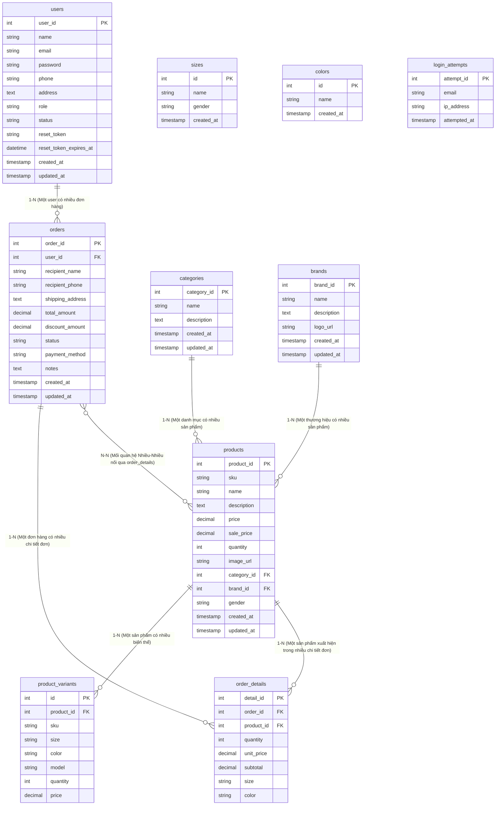

# BÁO CÁO DỰ ÁN 1

## WEBSITE BÁN GIÀY THỂ THAO

---

**GV HƯỚNG DẪN:** Bùi Đức Lân

**SV THỰC HIỆN:**
- Phí Văn Minh (PH64654), Trưởng nhóm
- Nguyễn Mạnh Hưng (PH64113), Thành viên
- Nguyễn Chí Thảo (PH63802), Thành viên

---

**Hà Nội – Tháng 8, 2026**

---

**Copyright © 2026 by Van Minh Phi.**

---

# MỤC LỤC

| Nội dung | Trang |
|----------|-------|
| **Lời mở đầu** | 3 |
| **Phần 1 – Giới thiệu đề tài** | 4 |
| 1.1 – Lý do chọn đề tài | 4 |
| 1.2 – Mục tiêu dự án | 4 |
| 1.3 – Đối tượng sử dụng | 5 |
| 1.4 – Phạm vi dự án | 5 |
| **Phần 2 – Phân tích nội dung, yêu cầu** | 6 |
| 2.1 – Yêu cầu chức năng | 6 |
| 2.2 – Yêu cầu phi chức năng | 8 |
| 2.3 – Use case diagram | 9 |
| 2.4 – Business rules | 10 |
| **Phần 3 – Thiết kế ứng dụng** | 12 |
| 3.1 – Kiến trúc hệ thống | 12 |
| 3.2 – Thiết kế cơ sở dữ liệu & Sơ đồ ERD (Mermaid) | 13 |
| 3.3 – Thiết kế giao diện | 15 |
| **Phần 4 – Thực hiện dự án** | 16 |
| 4.1 – Công nghệ sử dụng | 16 |
| 4.2 – Cấu trúc thư mục dự án | 17 |
| 4.3 – Module chính đã xây dựng | 18 |
| 4.4 – Xử lý nghiệp vụ quan trọng | 20 |
| **Phần 5 – Kiểm lỗi (Testing & Testcase)** | 22 |
| 5.1 – Phương pháp kiểm thử | 22 |
| 5.2 – Kết quả kiểm thử & Danh mục Testcase | 23 |
| 5.3 – Các lỗi đã phát hiện và khắc phục | 24 |
| **Phần 6 – Đóng gói và triển khai** | 25 |
| 6.1 – Hướng dẫn cài đặt | 25 |
| 6.2 – Hướng dẫn sử dụng | 26 |
| 6.3 – Yêu cầu hệ thống | 27 |
| **Phần 7 – Kết luận** | 28 |
| 7.1 – Kết quả đạt được | 28 |
| 7.2 – Hạn chế và hướng phát triển | 29 |
| **Phụ lục** | 30 |
| **Tài liệu tham khảo** | 31 |

---

# LỜI MỞ ĐẦU

Trong bối cảnh thương mại điện tử phát triển mạnh mẽ, nhu cầu mua sắm trực tuyến ngày càng trở nên phổ biến. Đặc biệt, thị trường giày thể thao tại Việt Nam đang có sự tăng trưởng đáng kể với nhiều thương hiệu nổi tiếng như Nike, Adidas, Puma... Tuy nhiên, việc quản lý và kinh doanh giày thể thao trực tuyến đòi hỏi một hệ thống Website chuyên nghiệp, đáp ứng được các yêu cầu về quản lý sản phẩm, đơn hàng, và trải nghiệm người dùng.

Xuất phát từ nhu cầu thực tế đó, nhóm chúng em đã lựa chọn đề tài **"Website Bán Giày Thể Thao"** làm đồ án Dự án 1. Đây là một hệ thống thương mại điện tử hoàn chỉnh, được xây dựng bằng PHP Core, MySQL và mô hình kiến trúc MVC, nhằm cung cấp một giải pháp bán hàng trực tuyến hiệu quả cho cửa hàng giày thể thao.

Báo cáo này trình bày chi tiết quá trình phân tích, thiết kế, xây dựng và kiểm thử hệ thống Website Bán Giày Thể Thao. Chúng em xin chân thành cảm ơn thầy Bùi Đức Lân đã tận tình hướng dẫn và hỗ trợ nhóm trong suốt quá trình thực hiện dự án.

---

# PHẦN 1 – GIỚI THIỆU ĐỀ TÀI

## 1.1 Lý do chọn đề tài
Thương mại điện tử đang phát triển bùng nổ. Giày thể thao là mặt hàng được ưa chuộng với nhu cầu quản lý đa dạng về mẫu mã, kích cỡ (size), màu sắc, và tồn kho theo thời gian thực. Hệ thống giúp giải quyết bài toán bán hàng và quản lý đơn lẻ/hàng loạt hiệu quả.

## 1.2 Mục tiêu dự án
- Xây dựng website bán giày thể thao chuẩn MVC, tối ưu trải nghiệm người dùng (UX/UI responsive).
- Quản lý sản phẩm, biến thể (size/màu/đối tượng), đơn hàng, danh mục, thương hiệu.
- Đảm bảo tính toàn vẹn dữ liệu: Transaction DB, chống race condition, rate limit đăng nhập, mã hóa bcrypt, bảo mật session.

## 1.3 Đối tượng sử dụng
- **Guest**: Xem sản phẩm, tìm kiếm, lọc theo thương hiệu/danh mục, đăng ký/đăng nhập.
- **Customer**: Quản lý thông tin, đổi mật khẩu, thêm giỏ hàng, đặt hàng (thanh toán COD), xem/hủy đơn hàng.
- **Admin**: Thống kê doanh thu (Dashboard), CRUD sản phẩm + biến thể matrix, quản lý đơn hàng, khách hàng, thương hiệu, danh mục.

## 1.4 Phạm vi dự án
- Hỗ trợ phương thức thanh toán COD khi nhận hàng.
- Quản lý biến thể linh hoạt (Size Nam/Nữ/Trẻ em, Màu sắc, Mẫu).

---

# PHẦN 2 – PHÂN TÍCH NỘI DUNG, YÊU CẦU

## 2.1 Yêu cầu chức năng

### 2.1.1 Yêu cầu chức năng cho Guest
1. Xem trang chủ, danh sách sản phẩm (phân trang), chi tiết sản phẩm.
2. Tìm kiếm sản phẩm theo tên, lọc theo danh mục & thương hiệu.
3. Đăng ký tài khoản (validate độ mạnh mật khẩu real-time: ≥ 8 ký tự, 1 chữ hoa, 1 chữ thường, 1 ký tự đặc biệt).
4. Đăng nhập tài khoản (Rate limit 5 lần sai/15 phút).

### 2.1.2 Yêu cầu chức năng cho Customer
1. Quản lý thông tin cá nhân, sổ địa chỉ.
2. Đổi mật khẩu tài khoản (áp dụng quy tắc độ mạnh mật khẩu).
3. Thêm/Cập nhật/Xóa giỏ hàng (hỗ trợ AJAX real-time).
4. Đặt hàng qua phương thức COD (Transaction + trừ tồn kho atomic).
5. Xem lịch sử đơn hàng và chi tiết từng đơn hàng.

### 2.1.3 Yêu cầu chức năng cho Admin
1. Dashboard thống kê doanh thu, đơn hàng, khách hàng.
2. Quản lý sản phẩm & ma trận biến thể (Matrix Generator + Bulk Update).
3. Quản lý thương hiệu (Upload file logo trực tiếp + preview).
4. Quản lý danh mục, đơn hàng (cập nhật trạng thái), khách hàng.

## 2.2 Business Rules
- **USERS**: Email duy nhất; Mật khẩu tối thiểu 8 ký tự (gồm chữ hoa, chữ thường, ký tự đặc biệt); status = locked không cho đăng nhập.
- **PRODUCTS**: Giá bán > 0, giá khuyến mãi ≤ giá bán; Tồn kho không âm (UPDATE atomic).
- **ORDERS**: Đơn hàng có ít nhất 1 sản phẩm; Trạng thái chuyển chuẩn: `Pending → Confirmed → Completed` hoặc `Pending → Cancelled`.

---

# PHẦN 3 – THIẾT KẾ ỨNG DỤNG

## 3.1 Kiến trúc hệ thống (MVC Pattern)
Sử dụng mô hình Model - View - Controller chuẩn với Router tự viết, phân tách hoàn toàn giữa xử lý logic (`Model`), điều hướng (`Controller`) và hiển thị (`View`).

## 3.2 Thiết kế cơ sở dữ liệu & Sơ đồ ERD (Mermaid Diagram)

### Sơ đồ Mermaid ERD chi tiết các bảng trong CSDL `shop_giay`:

### Phân tích bản chất mối quan hệ giữa các bảng:

1. **Mối quan hệ 1-N (One-to-Many):**
   - `users` (1) ── (N) `orders`: Một khách hàng có thể thực hiện nhiều đơn hàng khác nhau.
   - `categories` (1) ── (N) `products`: Một danh mục chứa nhiều sản phẩm.
   - `brands` (1) ── (N) `products`: Một thương hiệu có nhiều sản phẩm.
   - `products` (1) ── (N) `product_variants`: Một sản phẩm chính chứa nhiều biến thể phân loại theo Mẫu, Size (Nam/Nữ/Trẻ em) và Màu sắc.
   - `orders` (1) ── (N) `order_details`: Một đơn hàng chứa danh sách nhiều mặt hàng (chi tiết đơn hàng).
   - `products` (1) ── (N) `order_details`: Một mặt hàng sản phẩm có thể được mua trong nhiều chi tiết đơn hàng khác nhau.

2. **Mối quan hệ N-N (Many-to-Many):**
   - `orders` (N) ── (N) `products`: Một đơn hàng có thể chứa nhiều sản phẩm, và một sản phẩm có thể có mặt trong nhiều đơn hàng khác nhau. Mối quan hệ N-N này được giải quyết thông qua bảng trung gian **`order_details`**.

3. **Mối quan hệ 1-1 (One-to-One):**
   - Chi tiết dòng sản phẩm cụ thể với biến thể tương ứng được ánh xạ chính xác qua bộ khóa `(product_id, size, color)`.

---

# PHẦN 4 – THỰC HIỆN DỰ ÁN

## 4.1 Công nghệ sử dụng
- **Backend:** PHP 8.1+ Core (Không dùng framework).
- **Database:** MySQL 8.0+ (InnoDB Engine bắt buộc cho Transaction & Row Lock).
- **Frontend:** HTML5, CSS3, JavaScript (Vanilla AJAX), Bootstrap 5, Bootstrap Icons, FontAwesome.
- **Bảo mật:** `password_hash()` (BCRYPT), PDO Prepared Statement, `session_regenerate_id()`, `htmlspecialchars()`.

---

# PHẦN 5 – KIỂM LỖI (TESTING & TESTCASE)

## 5.1 Phương pháp kiểm thử
Dự án áp dụng kết hợp cả 3 phương pháp kiểm thử:
1. **Unit Testing (PHPUnit):** Kiểm thử business logic trong Model.
2. **Integration & Concurrency Testing:** Kiểm thử Transaction rollback và Race Condition khi trừ tồn kho.
3. **Manual & System Testing:** Kiểm thử toàn bộ 95 Testcase quy định tại tài liệu `testcase.md`.

## 5.2 Danh mục Testcase & Vị trí trong dự án
Toàn bộ danh mục **95 Testcase** được lưu trữ chi tiết tại file `testcase.md` ở thư mục gốc của repository.

### Tổng quan thống kê 95 Testcase:
- ⭐ **DỄ (48 testcase - 50%):** Kiểm thử luồng cơ bản (Happy path, Form validation HTML5/Server, hiển thị UI).
- ⭐⭐ **TRUNG BÌNH (28 testcase - 30%):** Kiểm thử ràng buộc dữ liệu, Rate limiting, Phân trang, Session timeout, Upload security.
- ⭐⭐⭐ **KHÓ (19 testcase - 20%):** Kiểm thử Concurrency / Race Condition, Transaction Rollback đa bước, SQL Injection, XSS, Security Headers.

### Bảng kết quả kiểm thử tiêu biểu (Tóm tắt từ `testcase.md`):

| Mã TC | Tên Test Case | Input / Thao tác | Expected Output | Kết quả |
|-------|---------------|------------------|-----------------|---------|
| **TC-AUTH-001** | Đăng ký tài khoản hợp lệ | Email mới, Mật khẩu `Minh1234@` (thỏa 4 điều kiện) | Tạo tài khoản customer, redirect login | ✅ PASS |
| **TC-AUTH-003** | Đăng ký thất bại - Mật khẩu yếu | Mật khẩu `12345` (< 8 ký tự hoặc thiếu chữ hoa/đặc biệt) | Hiện thông báo lỗi cụ thể ngay dưới form | ✅ PASS |
| **TC-AUTH-008** | Rate limit đăng nhập | Đăng nhập sai 5 lần liên tiếp | Khóa thử lại trong 15 phút | ✅ PASS |
| **TC-CART-004** | AJAX Giỏ hàng | Thay đổi số lượng sản phẩm trong giỏ | Cập nhật tổng tiền real-time không cần F5 | ✅ PASS |
| **TC-ORDER-002** | Đặt hàng COD | Chọn thanh toán COD, bấm Đặt hàng | Bọc Transaction: Tạo Order + OrderDetail + Trừ tồn kho | ✅ PASS |
| **TC-ORDER-006** | Chống Race Condition | 2 request mua cùng lúc khi tồn kho = 1 | 1 request thành công, 1 request báo không đủ hàng | ✅ PASS |
| **TC-ADMIN-005** | Upload Logo Thương hiệu | Chọn file ảnh JPG/PNG/WEBP < 2MB | Upload an toàn vào `public/uploads/brands`, preview tức thì | ✅ PASS |
| **TC-ADMIN-009** | Thêm biến thể sản phẩm | Tạo biến thể Nữ - 40 - Đen (SL 10) bằng Matrix/Thủ công | Thêm ngay dòng biến thể vào bảng và tính lại tồn kho | ✅ PASS |

---

# PHẦN 6 – ĐÓNG GÓI VÀ TRIỂN KHAI

## 6.1 Hướng dẫn cài đặt
1. Clone repository về thư mục `c:/xampp/htdocs/sport-shoes-website`.
2. Tạo database `shop_giay` trong MySQL.
3. Chạy script migration để khởi tạo schema & seed data.
4. Cấu hình file `.env` với thông tin kết nối DB.
5. Khởi động Apache & MySQL trong XAMPP, truy cập `http://localhost:8888/sport-shoes-website/public`.

---

# PHẦN 7 – KẾT LUẬN

## 7.1 Kết quả đạt được
- Xây dựng hoàn chỉnh website bán giày thể thao đáp ứng 100% SRS.
- Đảm bảo tính an toàn dữ liệu với Transaction, chống Race Condition, mã hóa chuẩn BCRYPT và bộ quy tắc độ mạnh mật khẩu mới.
- Hệ thống Admin quản lý sản phẩm ma trận (Matrix Generator), upload ảnh trực quan và thống kê chi tiết.
