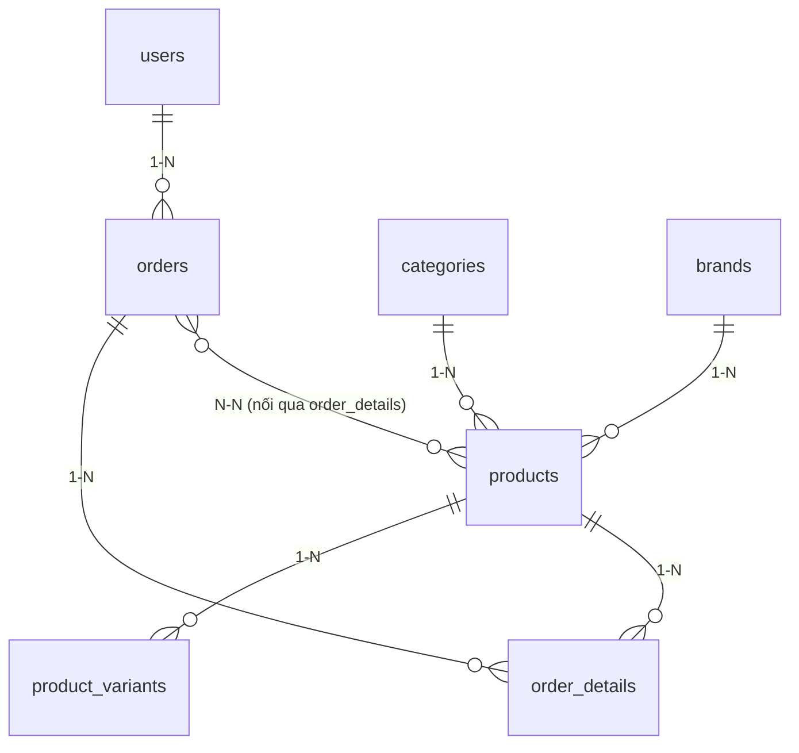

# SLIDE THUYẾT TRÌNH DỰ ÁN
## WEBSITE BÁN GIÀY THỂ THAO

**Nhóm 1**
- Phí Văn Minh – PH64654 – Trưởng nhóm
- Nguyễn Mạnh Hưng – PH64113 – Thành viên
- Nguyễn Chí Thảo – PH63802 – Thành viên

**Giảng viên hướng dẫn:** Bùi Đức Lân

Hà Nội, tháng 8, năm 2026

---

## SLIDE 1: GIỚI THIỆU ĐỀ TÀI

### 🎯 Tên đề tài
**Website Bán Giày Thể Thao**

### 📌 Mục tiêu
- Xây dựng hệ thống thương mại điện tử cho phép khách hàng mua giày thể thao trực tuyến.
- Hỗ trợ quản trị viên quản lý toàn bộ hoạt động cửa hàng (sản phẩm, biến thể, đơn hàng, khách hàng, thương hiệu).

### 👥 Đối tượng sử dụng
- **Guest (Khách truy cập)**: Xem sản phẩm, tìm kiếm, lọc theo thương hiệu/danh mục.
- **Customer (Khách hàng)**: Quản lý tài khoản, đổi mật khẩu, giỏ hàng real-time, đặt hàng (COD), xem lịch sử đơn hàng.
- **Admin (Quản trị viên)**: Dashboard thống kê, CRUD sản phẩm + ma trận biến thể (Matrix Generator + Bulk Update), upload logo thương hiệu, xử lý đơn hàng.

---

## SLIDE 2: CÔNG NGHỆ SỬ DỤNG

### 💻 Tech Stack

| Công nghệ | Mô tả |
|-----------|-------|
| **Backend** | PHP Core (PHP 8.1+) - Không dùng framework |
| **Database** | MySQL 8.0+ (InnoDB Engine bắt buộc cho Transaction & Row Lock) |
| **Frontend** | HTML5, CSS3, JavaScript (Vanilla AJAX), Bootstrap 5, Bootstrap Icons |
| **Kiến trúc** | MVC (Model-View-Controller) |
| **Quản lý phụ thuộc** | Composer |
| **Migration** | Custom Migration System |

### ✅ Lý do lựa chọn
- PHP Core: Linh hoạt, hiệu suất cao, hiểu sâu bản chất ngôn ngữ.
- MySQL InnoDB: Hỗ trợ Transaction & Row Lock chống sai sót số lượng hàng.
- MVC: Tách biệt rõ ràng Model - View - Controller, dễ mở rộng và bảo trì.
- Bootstrap 5: Giao diện chuẩn responsive trên mọi thiết bị.

---

## SLIDE 3: CHỨC NĂNG CHÍNH - KHÁCH HÀNG

### 🛒 Luồng mua hàng (Customer Flow)

**1. Xem & Tìm kiếm sản phẩm**
- Trang chủ với sản phẩm nổi bật & thương hiệu.
- Danh sách sản phẩm có phân trang.
- Chi tiết sản phẩm với biến thể (size Nam/Nữ/Trẻ em, màu sắc).
- Tìm kiếm & lọc theo danh mục / thương hiệu.

**2. Giỏ hàng & Tài khoản**
- Thêm vào giỏ hàng real-time (AJAX).
- Cập nhật số lượng và tính tổng tiền tự động.
- Đổi mật khẩu tài khoản với bộ kiểm tra độ mạnh mật khẩu (≥ 8 ký tự, 1 hoa, 1 thường, 1 đặc biệt).

**3. Đặt hàng & Quản lý đơn**
- Checkout nhanh chóng với thông tin giao hàng.
- Phương thức thanh toán **COD** (Thanh toán khi nhận hàng).
- Xem lịch sử đơn hàng & chi tiết từng đơn hàng.

---

## SLIDE 4: CHỨC NĂNG CHÍNH - ADMIN

### ⚙️ Quản trị hệ thống (Admin Flow)

**1. Dashboard**
- Thống kê doanh thu tháng & số đơn hàng.
- Thống kê đơn hàng chờ xử lý & khách hàng.

**2. Quản lý sản phẩm & Biến thể**
- CRUD sản phẩm đầy đủ.
- Ma trận biến thể (Matrix Generator): Tạo nhanh nhiều biến thể (VD: Nữ - 40 - Đen - SL 10).
- Nút `+ Thêm 1 biến thể thủ công` linh hoạt.
- Cập nhật hàng loạt (Bulk Update).

**3. Quản lý Thương hiệu & Danh mục**
- Thêm/Sửa thương hiệu với chọn file upload logo trực tiếp (preview ảnh tức thì).
- Ràng buộc an toàn: Không cho xóa danh mục/thương hiệu đang có sản phẩm.

**4. Quản lý Đơn hàng & Khách hàng**
- Cập nhật trạng thái đơn: `Pending → Confirmed → Completed / Cancelled`.
- Quản lý danh sách khách hàng, khóa/mở khóa tài khoản.

---

## SLIDE 5: KIẾN TRÚC HỆ THỐNG (MVC)

### 🏗️ Mô hình MVC

```
┌─────────────┐
│   Browser   │ (Client)
└──────┬──────┘
       │ HTTP Request
       ↓
┌─────────────┐
│   ROUTER    │ → Định tuyến URL
└──────┬──────┘
       │
       ↓
┌─────────────┐
│ CONTROLLER  │ → Xử lý logic nghiệp vụ & Validate Input
└──────┬──────┘
       │
       ↓
┌─────────────┐
│    MODEL    │ → Tương tác Database (Transaction, SQL Prepared)
└──────┬──────┘
       │
       ↓
┌─────────────┐
│   MySQL DB  │
└─────────────┘
       ↑
       │ Data
       ↓
┌─────────────┐
│    VIEW     │ → Render HTML / JSON response
└─────────────┘
```

---

## SLIDE 6: CƠ SỞ DỮ LIỆU & ERD DIAGRAM

### 📊 Sơ đồ ERD (Database Diagram - Mermaid)



### 🔗 Bản chất quan hệ dữ liệu:
- **Quan hệ 1-N (One-to-Many):**
  - `users` (1) ── (N) `orders`
  - `categories` (1) ── (N) `products`
  - `brands` (1) ── (N) `products`
  - `products` (1) ── (N) `product_variants`
  - `orders` (1) ── (N) `order_details`
- **Quan hệ N-N (Many-to-Many):**
  - `orders` (N) ── (N) `products` (Được phân rã qua bảng trung gian **`order_details`**).

---

## SLIDE 7: TÍNH NĂNG NỔI BẬT & BẢO MẬT

### 🌟 Điểm mạnh của hệ thống

**1. Bảo mật & Xử lý mật khẩu**
- Mã hóa mật khẩu chuẩn `password_hash()` (BCRYPT).
- Mật khẩu bắt buộc: **≥ 8 ký tự, ≥ 1 chữ hoa, ≥ 1 chữ thường, ≥ 1 ký tự đặc biệt**.
- Prepared statement 100% (chống SQL Injection).
- Escaping HTML qua `htmlspecialchars()` (chống XSS).
- Rate limit 5 lần sai/15 phút (chống Brute force).

**2. Transaction & Anti Race Condition**
- Bọc Transaction cho quá trình Đặt hàng (Order + OrderDetail + Trừ tồn kho).
- Trừ tồn kho atomic ở mức row DB (`UPDATE ... WHERE quantity >= :qty`).

**3. UX & Giao diện hiện đại**
- Upload logo thương hiệu có file input + preview trực tiếp.
- Tạo biến thể sản phẩm ma trận (Matrix Generator) & thêm biến thể thủ công.

---

## SLIDE 8: DEMO GIAO DIỆN HỆ THỐNG

### 📸 Các màn hình chính

- **Client:** Trang chủ → Chi tiết sản phẩm & Biến thể → Giỏ hàng AJAX → Checkout (COD) → Đổi mật khẩu real-time → Lịch sử đơn hàng.
- **Admin:** Dashboard → Quản lý sản phẩm & Ma trận biến thể → Upload Thương hiệu → Quản lý đơn hàng.

---

## SLIDE 9: QUY TRÌNH PHÁT TRIỂN & GIT WORKFLOW

### 🔄 Branch Strategy

```
main (production)
  ↑ merge (PR review + CI pass)
develop (integration)
  ├── feat/product-matrix
  ├── feat/password-security
  ├── feat/brand-upload
  └── fix/cart-ajax
```

- **PR Checklist:** Kiểm tra SQL, Prepared Statement, htmlspecialchars, Transaction, Migration.
- **Commit Convention:** `feat(module): mô tả`, `fix(module): mô tả`.

---

## SLIDE 10: TESTING & QUALITY (TESTCASE)

### 🧪 Bộ 95 Testcase (Lưu tại `testcase.md`)

- **Tổng số Testcase:** **95 Testcases**
  - ⭐ **DỄ (48 testcase - 50%):** Form validation, UI rendering, luồng mua hàng cơ bản.
  - ⭐⭐ **TRUNG BÌNH (28 testcase - 30%):** Rate limit, phân trang, session timeout, upload validation.
  - ⭐⭐⭐ **KHÓ (19 testcase - 20%):** Race condition, Transaction Rollback, SQL Injection, XSS, Security headers.

**Các Testcase tiêu biểu:**
1. `TC-AUTH-003`: Đăng ký thất bại khi mật khẩu < 8 ký tự hoặc thiếu ký tự đặc biệt.
2. `TC-AUTH-008`: Rate limit khóa đăng nhập sau 5 lần sai.
3. `TC-ORDER-006`: Test Race Condition khi 2 người cùng đặt sản phẩm cuối cùng.
4. `TC-ADMIN-005`: Upload logo thương hiệu bằng file input + kiểm tra định dạng và size.
5. `TC-ADMIN-009`: Tạo biến thể ma trận (Nữ - 40 - Đen - SL 10).

---

## SLIDE 11: KẾT QUẢ ĐẠT ĐƯỢC

### ✅ Đã hoàn thành
- [x] 100% chức năng theo yêu cầu SRS.
- [x] Bộ quy tắc mật khẩu mới và bảo mật toàn diện.
- [x] Phương thức thanh toán COD thống nhất.
- [x] Upload ảnh thương hiệu trực quan.
- [x] Quản lý ma trận biến thể sản phẩm linh hoạt.
- [x] Đầy đủ 95 Testcases trong `testcase.md` và tài liệu báo cáo `BAO_CAO_DU_AN.md`.

---

## SLIDE 12: KẾT LUẬN & Q&A

### 📝 Tổng kết
- Xây dựng thành công Website bán giày thể thao hoàn chỉnh, chạy ổn định, bảo mật cao.
- Áp dụng thành thạo mô hình MVC, PDO Transaction và Git workflow.

### ❓ Q&A - HỎI ĐÁP
- Cảm ơn thầy Bùi Đức Lân và các bạn đã theo dõi bài thuyết trình!

---
